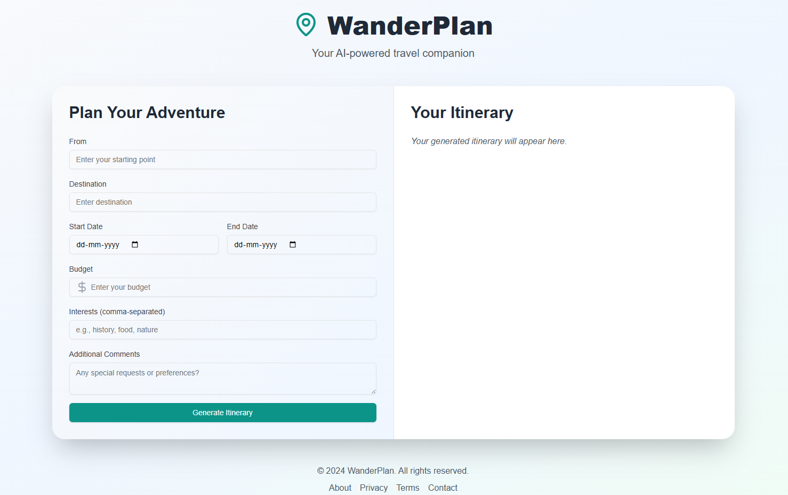

# WanderPlan

## AI-Powered Travel Itinerary Generator

WanderPlan is an AI-powered travel companion built with Next.js that helps users generate personalized travel itineraries based on destination, travel dates, budget, interests, and additional preferences.

---

## Features

- AI-generated travel itineraries
- Personalized trip planning
- Budget-aware recommendations
- Interest-based itinerary generation
- Beautiful Markdown itinerary rendering
- Download generated itinerary as a text file
- Smooth animations and responsive UI
- Clean modern interface

---

## Preview

### Home Screen



---

## Tech Stack

- Next.js
- React
- TypeScript
- Tailwind CSS
- Framer Motion
- React Markdown
- Lucide React
- Gemini API

---

## Getting Started

### Clone the repository

```bash
git clone https://github.com/sharur7/Wander-Plan-App.git
cd Wander-Plan-App
```

### Install dependencies

```bash
npm install
```

### Setup environment variables

Create a `.env.local` file in the root directory:

```env
NEXT_PUBLIC_GEMINI_API_TOKEN=your_api_key_here
```

### Run the development server

```bash
npm run dev
```

Open `http://localhost:3000` in your browser.

---

## Build for Production

```bash
npm run build
npm start
```

---

## Project Structure

```bash
app/          # Main application pages
components/   # Reusable UI components
lib/          # Utility functions
public/       # Static assets
```

---

## How It Works

1. Enter travel details
2. Select dates and budget
3. Add interests/preferences
4. Generate itinerary using AI
5. Download and save the travel plan

---

## Notes

- Uses Gemini API for itinerary generation
- Markdown-based itinerary formatting
- Optimized for desktop and mobile devices

---

## License

MIT License

---

Built with ❤️ using Next.js and AI.
